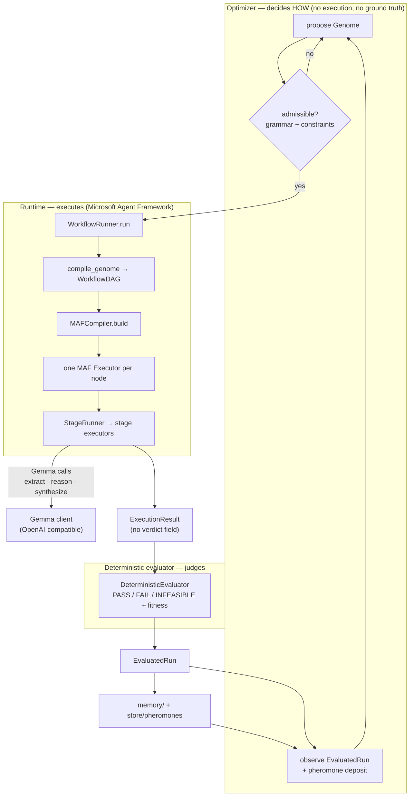

# Wynk — ACO Agent Workflow Optimizer

[](https://github.com/Aryabhatta-0/Wynk/actions/workflows/ci.yml)

Wynk is a **search system for agentic workflows**. Instead of a human hand-writing the pipeline
for an agent task, Wynk represents a workflow as a *genome* — an ordered tuple of typed stages —
and searches the space of genomes with ant-colony optimisation, scored by a **deterministic
evaluator**.

The bet: the win is not only *which* steps you run, but which steps you **leave out**. Turning
every stage on makes a pipeline heavier, slower, and easier to fail (see the
[full-pipeline ablation](#aco-vs-fixed-and-model-chosen-workflows)). Wynk's advantage comes from
choosing a per-task-class structure.

The project is research-grade: it runs end-to-end against a real hosted Gemma model, and every
result below is reproducible from frozen artifacts.

---

## Architecture

Four authorities, each with exactly one job. The boundaries are enforced by tests
(`tests/test_authority_boundaries.py`), not by convention.

| Authority | Only does | Never does |
|---|---|---|
| **Gemma** | extract, reason, synthesize (+ self-consistency sampling) | judge correctness, choose workflow, see ground truth, steer the optimizer |
| **Optimizer / ACO** | decide *how* to execute (workflow structure/config) | execute workflows, judge answers, see ground truth |
| **MAF** (via compiler/runtime) | execute the compiled graph | plan the workflow, judge correctness |
| **Deterministic evaluator** | PASS / FAIL / INFEASIBLE + search fitness | ask an LLM for a verdict |

### The closed loop



Two invariants make this loop honest:

* `ExecutionResult` has **no** verdict/fitness field. Only `Evaluation` does, and only the
  evaluator builds it. The optimizer literally cannot see a judge it might steer.
* Budget breach is decided by `usage_exceeds()` — pure arithmetic — never by a model.

### Runtime pipeline in detail

```
ExecutionTask (TaskContract + one row's inputs) + Genome
  → WorkflowRunner.run
  → compile_genome(genome)          # pure: same genome ⇒ same DAG + dag_hash
  → MAFCompiler.build(dag)
  → one MAF Executor per node       # runtime/maf_nodes.py
  → StageRunner → stage executors
  → ExecutionResult
```

`compile_genome` (`compiler/dag.py`) is pure and validated with NetworkX: acyclic, connected, one
`Task` source, one `Answer` sink, edge types match. Failure strategies (`retry-1`, `retry-2`) are
node attributes, not back-edges — so the graph stays a DAG and the compiler stays deterministic.

### Repository layout

```
core/          frozen shared contracts + pure deterministic rules (no I/O, no LLM, no MAF)
optimizers/    search algorithms            -> may import core only
compiler/      Genome -> DAG -> framework   -> core (+ MAF, lazily, only in maf_compiler.py)
runtime/       executors, budget guard, model client
evaluation/    deterministic evaluator      -> the only authority for verdict + fitness
benchmarks/    snapshots, TaskSpecs, splits -> frozen data + held-out test set
memory/        persistent workflow memory   -> written only from measured results, never an LLM
store/         run store contracts; dataset metadata (SQLite) + content-addressed blobs
ingestion/     dataset upload: parse/inspect CSV + JSONL, register DatasetSpec, seeded splits
api/           chat demo + product API v1 (docs/dataset_ingestion.md)
router/        (later phase)
ui/            (later phase)
experiments/   search drivers, ablations, OSS baseline harness, reporting
docs/          frozen contracts + handoff notes
tests/         unit + contract + boundary tests
```

`agent_framework` may only be imported from `compiler/` and `runtime/`. Everything inside
`core/`, `optimizers/`, `compiler/` and `runtime/` is forbidden from importing `TaskSpec`,
`GroundTruth`, `evaluation/`, `benchmarks/` or `store/` — so ground truth cannot leak into the
search.

---

## The search space (genome)

A genome is an **ordered** tuple of typed stages. Order is part of identity:
`EXTRACT → VERIFY → SYNTHESIZE` and `EXTRACT → SYNTHESIZE → VERIFY` are different genomes with
different hashes.

Canonical form is compact, key-sorted ASCII JSON (`{"schema":"genome/1","stages":[...]}`); the
hash is its SHA-256. No timestamps, UUIDs, dict ordering or environment dependence — a golden
hash is pinned across processes and `PYTHONHASHSEED` values in `tests/test_genome.py`.

| Stage | Options (MVP) |
|---|---|
| `GATHER` | source `fetch` / `api`; mode `parallel-2` / `parallel-4` |
| `FILTER` | `keyword_chunk` / `section_select` |
| `EXTRACT` | `direct` / `schema_guided` |
| `REASON` | `single` / `decompose` |
| `VERIFY` | `evidence_span` with `retry-1` / `retry-2` |
| `SYNTHESIZE` | `direct` / `cite_evidence` |
| `DIRECT` | `answer` / `cot` — Task → Answer without retrieval (uploaded-dataset contracts) |
| `CONFIDENCE_GATE` | `support-50` / `support-100` — terminal evidence-support gate (contracts with context) |

The benchmark keeps the six-stage `grammar/1` vocabulary (its search space is pinned unchanged);
a task contract selects its own vocabulary. See [docs/workflow_grammar.md](docs/workflow_grammar.md)
for every stage's input/output, successors, configuration, admission rule and search-space size.

A genome is plain data and may be partial. **Validity is decided by `core/grammar.py` and
`core/constraints.py`, never by the optimizer.** Hard constraints include e.g. at most 2 `VERIFY`
steps and a static token-budget check (`core/cost_model.py`). A proposal that is not complete and
admissible is rejected by `ensure_admissible` before it can run. A genome that would exceed a
task's cap is refused at runtime and scores `-1`, so search budget is never silently wasted on
pipelines that cannot execute.

### Optimizers

`optimizers/` contains `MMASACO` (max-min ant system: edge pheromones over the shared grammar),
`RandomSearch`, and the experimental `ExhaustiveSearch`, `PBIL`, `Racing`,
`SuccessiveHalving`, `ThompsonSamplingBandit`. All derive randomness from `context.seed`; no
algorithm-specific concept lives in the base `Optimizer`. The real runs below use **MMAS ACO vs.
random search**.

---

## The evaluator (deterministic, off-line)

`evaluation/` holds schema checks, matchers (`exact`, `normalized_text`, `numeric_tolerance`,
`date`, `set_equal`), evidence verification, and the shaped fitness.

* Verdicts are `PASS` / `FAIL` / `INFEASIBLE`.
* `fitness/mvp-2`: the `PASS` band is `[1.0, 1.1]`, scored by budget *headroom* against **the task
  being run** (a 2k-token task and a 20k-token task both mean the same thing by "cheap"). Wall-clock
  is *not* scored — it is a hard cap, and as a soft term it is pure infrastructure noise feeding
  the pheromone deposit.
* Evidence is checked against the frozen snapshot: a fabricated span hash, or a span that does not
  contain the cited value, is a `FAIL`.

---

## Benchmarks

`benchmarks/` holds the frozen MVP benchmark plus a held-out test set.

| Split | Purpose | Notes |
|---|---|---|
| `train` | used by the search | Class A + Class B |
| `validation` | selects the incumbent workflow | never used to report a result |
| `heldout` (`benchmarks/heldout/`) | **reporting only** | 16 tasks, hash `f88b7fc4…`; outside `benchmarks/snapshots`, so the MVP `benchmark_hash` is unchanged |

* **Class A** — extract facts from static fact-sheet pages (with distractor numbers/dates).
* **Class B** — filter/aggregate over a JSON API (`mock_api`); truth computed from records.

The held-out set is rendered by the **same** generators, question templates, caps and matchers as
the MVP benchmark, over 8 new fictional companies and 8 new inventory seeds. No optimizer has read
it. Regenerate with `python -m benchmarks.build` / `python -m benchmarks.heldout`; both are
hash-pinned by tests.

### External benchmarks

`experiments/external/` runs public benchmarks through a single adapter, currently MuSiQue and
MMLU-Pro. The adapter pins the official file by revision and SHA-256, draws a stratified hash
sample, sanitizes rows to the declared columns, and builds a `TaskContract` from a hash-locked
protocol. It then freezes a manifest and drives the unchanged fixed / random / ACO runner.

A new benchmark defines only five things: its source, its sanitizer, its evaluator, its sampling
stratum and its fixed-baseline rule. The cross-benchmark results are in
`experiments/results/benchmark-matrix/REPORT.md`.

```bash
pip install -e ".[dev,maf,benchmarks]"   # pyarrow reads MMLU-Pro's parquet
python -m experiments.external.run prepare --benchmark mmlu-pro --protocol v1 --source <parquet>
python -m experiments.external.run run      --benchmark mmlu-pro --protocol v1 --source <parquet>
python -m experiments.external.run assemble --benchmark mmlu-pro --protocol v1 --source <parquet>
python -m experiments.external.matrix
```

---

## Quickstart

```bash
pip install -e ".[dev]"      # pydantic, networkx, pytest, ruff, matplotlib
python -m pytest
python -m ruff check . && python -m ruff format --check .
pip install -e ".[dev,maf]"  # adds Microsoft Agent Framework: enables the MAF/e2e tests
```

Synthetic objective demo (no model, no network):

```bash
python -m experiments.learning_curves --synthetic --task-class B   # -> experiments/results/
```

Real MVP demo (Gemma + MAF runtime + deterministic evaluator). Needs an OpenAI-compatible Gemma
endpoint (used: OpenRouter / ZenMux with `google/gemma-3-27b-it` or `gemma-4-31b-it`). Keys stay
in env.

```bash
export GEMMA_BASE_URL=https://openrouter.ai/api/v1 GEMMA_MODEL=google/gemma-3-27b-it GEMMA_API_KEY=$OPENROUTER_API_KEY
python -m experiments.run_mvp smoke                                   # 1 hand-built genome, 1 Class A task
python -m experiments.run_mvp experiment --budget 100 --seeds 3       # ACO vs random -> experiments/results/real/
python -m experiments.run_mvp final --task A-001                      # best ACO genome on a validation task
```

Every evaluation (train and validation) is appended to `evaluations.jsonl` with optimizer, seed,
split, evaluation #, genome hash, fitness, verdict and best-so-far. Parallel runs
(`run_search(..., workers=N)`) are order-preserving and seed-per-run, so results are identical to
`workers=1` — only wall time changes.

---

## Experiments

### ACO vs. fixed and model-chosen workflows

16 held-out tasks, 2 runs each (128 runs). *Answer correct* and *evidence valid* are measured with
the task's caps ignored, to separate answer quality from budget compliance.

| Workflow | Success | Answer correct* | Evidence valid* | Latency (s) | Tokens | Cost (USD) |
|---|---|---|---|---|---|---|
| **ACO workflow** | **81%** | **94%** | **81%** | 7.5 | 1235 | 0.000218 |
| Fixed minimal (`GENOME_A`) | 62% | 88% | 69% | **6.8** | **1159** | **0.000203** |
| **Fixed full (all stage types)** | **38%** | 38% | 52% | 11.7 | 1696 | 0.000300 |
| Gemma-chosen | 66% | 81% | 66% | 9.1 | 1306 | 0.000242 |

\* Measured ignoring the task's limits.

Turning every step on is the **worst** of the four. The full fixed pipeline is the heaviest one
actually allowed to run (12.2k estimated tokens would exceed the caps — 9k for A, 7k for B — and
score `-1` on every task); any variant with `self_consistency` fails the same check:

```
GATHER(fetch, parallel-4) → FILTER(keyword_chunk) → EXTRACT(schema_guided)
  → REASON(decompose) → VERIFY(evidence_span, retry-2) → SYNTHESIZE(cite_evidence)
  → VERIFY(evidence_span, retry-2)
```

**Why the full pipeline fails**

* **Class B:** 8 of 16 runs exceed the task's retry limit of 2 — two `retry-2` checks allow up to 4.
* **Class A:** 10 of 16 fail — 8 have no usable answer (the evidence check rejects them: *"evidence
  text does not contain the value"* / *"no evidence"*), and 2 are missing evidence for one field.
* **Cost:** ~45% more expensive than ACO (1696 vs 1235 tokens) and ~55% slower (11.7 s vs 7.5 s).

More steps means more ways to fail and more chances to break a limit. ACO's advantage comes from
choosing which steps to *omit*. Added as the `wynk_full` baseline in
`experiments/oss_baselines/harness.py` / `baselines.py`; results under
`experiments/results/oss_baselines/aco-fixed-full-gemma-r2/`. Small sample: 2 runs per task.

### Wynk vs. official OSS *starter* workflows

**Question tested:** can Wynk automatically discover a workflow that beats the *starter* workflows
a developer gets from popular open-source agent frameworks?

This is **not** Wynk vs. those frameworks — smolagents, CrewAI, LlamaIndex and LangGraph can all
build far stronger workflows than their starters. Every result is labelled with the exact starter
that was run. Full protocol and per-run records: [`experiments/oss_baselines/README.md`](experiments/oss_baselines/README.md).

| Label | Upstream (pinned) | Starter workflow |
|---|---|---|
| smolagents Starter Agent | `v1.26.0` @ `12c1bc8` | README quickstart `CodeAgent(tools, model)` |
| CrewAI Starter Research Workflow | `1.15.23` @ `deaa71e` | `crewai create crew` template: `researcher` + `research_task`, sequential |
| LlamaIndex Starter Agentic RAG | `v0.14.25` @ `f12d46a` | starter tutorial `FunctionAgent` (tool retrieval) |
| LangGraph Basic ReAct Agent | `1.2.12` @ `49cce0c` | quickstart `create_react_agent` |
| **Wynk (frozen)** | this repo | `frozen_wynk.json`, one genome per task class |

Setup: all systems use `google/gemma-4-31b-it` on the same OpenAI-compatible endpoint,
temperature 0, `max_tokens` 1024 per call, 120 s per-call timeout, 3 retries. Every external
starter gets the same two tools over the same frozen pages, `list_pages` and `read_page` (Wynk has
no web search). Each framework runs in its own pinned venv as a subprocess; all model traffic goes
through one metering proxy that records tokens, cost and the settings actually sent. Every answer
is scored by Wynk's **unchanged** deterministic evaluator (no LLM judge). Wynk is frozen *before*
any baseline runs (`harness freeze`, which refuses to overwrite itself): class A genome
`22a66da2…`, class B genome `7403cdbc…`.

**Results — 16 held-out tasks × 3 runs (240 executions).**

| Workflow | Success | Fitness | Answer correct* | Evidence valid* | Within caps | Latency | Tokens | Cost (USD) |
|---|---|---|---|---|---|---|---|---|
| smolagents Starter | 35% | −0.289 | 100% | 100% | 35% | 85.5 s | 10,524 | 0.00161 |
| CrewAI Starter | 94% | 1.010 | 94% | 100% | 100% | 62.4 s | 2,332 | 0.00039 |
| LlamaIndex Starter | 94% | 1.013 | 94% | 100% | 100% | 54.1 s | 2,097 | 0.00035 |
| LangGraph Basic ReAct | 94% | 1.014 | 94% | 100% | 100% | 54.0 s | 1,953 | 0.00033 |
| **Wynk (frozen)** | 81% | 0.970 | 94% | 81% | 100% | **33.5 s** | **1,221** | **0.00022** |

\* Caps ignored. Failure rate was 0% for every system.

Compared with the strongest starter (LangGraph), Wynk had:

* fitness **−4.4%**; the per-task difference has a 95% interval of **−0.114 to +0.008** — it could
  be zero;
* **37.5% fewer tokens**, lower on 16 of 16 tasks against every starter;
* **34.6% lower cost**, also lower on 16 of 16 tasks;
* **38.1% lower latency**, lower on 12 of 16 tasks.

**Where the outcome comes from**

* **Class A:** Wynk had the top fitness, 1.093 vs 1.084, at about half the tokens.
* **Class B, TB-005 and TB-006:** Wynk's answers are correct, but its class B workflow attached no
  evidence in 9 of 24 runs. That workflow was chosen with only a 33% validation pass rate.
* **Class B, TB-008:** every system except smolagents got the arithmetic wrong.
* **smolagents:** got every answer right (it calculates in Python), but its own system prompt
  pushed it over the token cap in 31 of 48 runs.

**Fairness caveats**

* **The evidence rule decides the fitness ranking.** External quotes are matched ignoring
  whitespace and allow excerpts joined by `…` — more lenient than Wynk's own exact matching. The
  three tool-calling starters each needed this for 9 of their class B passes. Re-scoring the
  recorded outputs with exact matching (no new runs) flips the result to **Wynk +3.2%** (95%
  interval −0.041 to +0.121). Under neither rule does the interval exclude zero.
* **Tuned vs. untuned.** Wynk's workflows are tuned per task class and its search saw 16 tasks of
  the same kind; the starters are generic and untuned.
* **Caps.** Token caps are part of each task; the starters do not know about them. Answer
  correctness with caps ignored is reported separately.
* **Tools and prompts.** Starters' web-search tools were swapped for page tools; CrewAI uses one
  generic topic and only its research agent; LlamaIndex has no vector index; smolagents writes
  Python instead of calling tools natively; only Wynk passes a random seed per call.
* **Latency.** All runs were measured with 10 running in parallel.
* One retried call (`wynk.TB-001.r2`, 120 s timeout) passed in 144 s; its token total is recorded
  as `null` rather than guessed.

**Strongest defensible conclusion**

> On 16 held-out tasks with the same Gemma 4 31B model, Wynk's frozen workflow matched the answer
> correctness of the three tool-calling starter workflows (94%) and stayed within every task cap.
> It used 37.5% fewer tokens than the strongest starter (LangGraph Basic ReAct Agent), with fewer
> tokens on every task. It did **not** achieve higher deterministic fitness: −4.4%, and the
> per-task interval includes zero.

Results live under `experiments/results/oss_baselines/full-r3/` (gitignored like all results).

---

## Docs

* [`docs/ARCHITECTURE_CONTRACTS.md`](docs/ARCHITECTURE_CONTRACTS.md) — frozen four-authority
  contracts, module dependency rules, contract change log
* [`docs/RUNTIME_MVP.md`](docs/RUNTIME_MVP.md) — Track B runtime: a genome end-to-end through MAF
* [`docs/durable_jobs.md`](docs/durable_jobs.md) — durable experiment jobs: crash/resume without
  duplicate spend, cancellation, leases, checkpoint format, `/api/v1/experiments`
* [`docs/champion_promotion.md`](docs/champion_promotion.md) — validation-selected challenger,
  held-out promotion gate, champion lineages, compare-and-promote, `/api/v1/champions`
* [`docs/experiment_provenance.md`](docs/experiment_provenance.md) — canonical experiment
  artifacts: ProvenanceRecord, integrity, metric tracing, replay from stored evidence
* [`docs/champion_inference.md`](docs/champion_inference.md) — immutable workflow versions,
  staging → production → rollback, fail-closed model binding, `/api/v1/workflows/{version}/invoke`
* [`docs/production_monitoring.md`](docs/production_monitoring.md) — feedback bound to inference
  records, per-version aggregates, drift, deterministic triggers, re-optimization challengers
* [`experiments/oss_baselines/README.md`](experiments/oss_baselines/README.md) — full OSS baseline
  protocol and per-run artifacts
* [`docs/HANDOFF.md`](docs/HANDOFF.md) — real-MVP integration notes and next steps

## Roadmap

1. **Evidence for derived values (Class B):** let a `REASON`/aggregate fact cite the set of source
   spans it was computed from, and accept that in the evaluator.
2. **Arithmetic:** route sums/products through a deterministic tool instead of the model.
3. **Grammar/runtime alignment:** implement or remove options the MVP runtime rejects
   (`jev`, `self_consistency`) so budget is not spent on genomes that cannot run.
4. **More seeds** for a statistically meaningful A comparison — runs are cheap now.
5. Optional tiny demo surface: task → candidate workflows → winner → evidence → curve.
